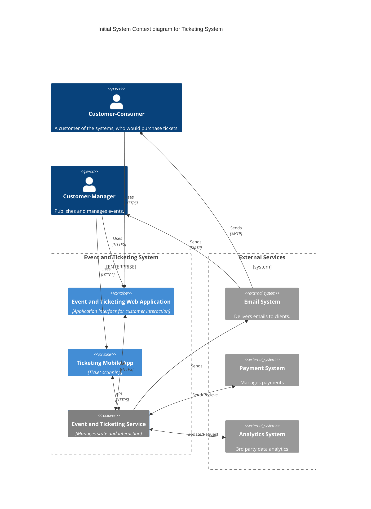

```mermaid
C4Context
    title Initial System Context diagram for Ticketing System
    Person(customerA, "Customer-Consumer", "A customer of the systems, who would purchase tickets.")
    Person(customerB, "Customer-Manager", "Publishes and manages events.")

    Enterprise_Boundary(eb, "Event and Ticketing System") {
        Container("wa", "Event and Ticketing Web Application", "Application interface for customer interaction")
        Container("ma", "Ticketing Mobile App", "Ticket scanning")
        Container("ba", "Event and Ticketing Service", "Manages state and interaction")
    }

    Boundary(b, "External Services") {
        System_Ext(SysEm, "Email System", "Delivers emails to clients.")
        System_Ext(SysPay, "Payment System", "Manages payments")
        System_Ext(SysEl, "Analytics System", "3rd party data analytics")
    }

    Rel(customerA, wa, "Uses", "HTTPS")
    Rel(customerB, wa, "Uses", "HTTPS")
    Rel(customerB, ma, "Uses", "HTTPS")
    UpdateRelStyle(customerA, wa, $offsetY="-40")
    UpdateRelStyle(customerB, wa, $offsetY="-40")
    UpdateRelStyle(customerB, ma, $offsetY="-40")

    Rel(SysEm, customerA, "Sends", "SMTP")
    Rel(SysEm, customerB, "Sends", "SMTP")
    UpdateRelStyle(SysEm, customerA, $offsetY="50" $offsetX="100")
    UpdateRelStyle(SysEm, customerB, $offsetY="-30" $offsetX="20")

    BiRel(ma, ba, "API", "HTTPS")
    BiRel(wa, ba, "API", "HTTPS")

    Rel(ba, SysEm, "Sends")
    BiRel(ba, SysPay, "Send/Recieve")
    BiRel(ba, SysEl, "Update/Request")
    UpdateRelStyle(ba, SysPay, $offsetY="-20")

    UpdateElementStyle(ba, $bgColor="grey")

    UpdateLayoutConfig($c4ShapeInRow="4" $c4BoundaryInRow="4")
```